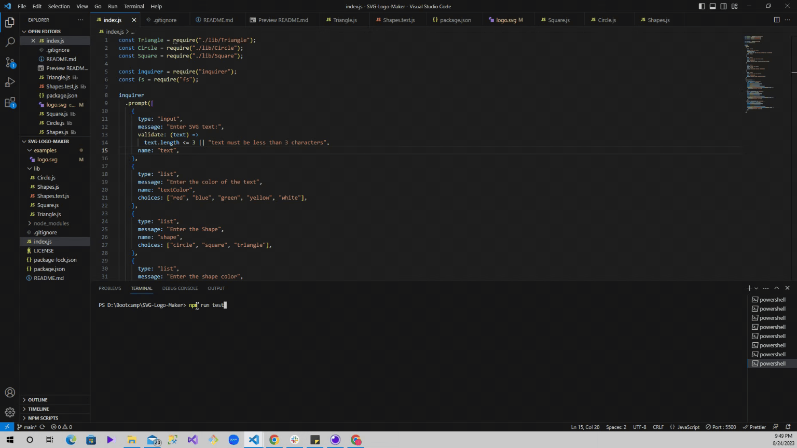

# SVG-Logo-Maker

## Table of Contents

- [Description](#description)
- [Usage](#usage)
- [License](#license)
- [Questions](#questions)

## Description

The application enables users to enter inputs into a inquirer prompt in order to generate a logo “logo.svg” file which contains the users desired results as an SVG image.

## Usage

<a href="https://drive.google.com/file/d/1r1YjwZOPMDN4KU7w12l25OOX76Z2G-cM/view">Link to SVG-Logo-Maker Functionability Video</a>

<<<<<<< HEAD

=======

>>>>>>> 8703846da3893cf2f60b6afffa16aa988a50135f

## Licence

THE SOFTWARE IS PROVIDED “AS IS”, WITHOUT WARRANTY OF ANY KIND, EXPRESS OR IMPLIED, INCLUDING BUT NOT LIMITED TO THE WARRANTIES OF MERCHANTABILITY, FITNESS FOR A PARTICULAR PURPOSE AND NONINFRINGEMENT. IN NO EVENT SHALL THE AUTHORS OR COPYRIGHT HOLDERS BE LIABLE FOR ANY CLAIM, DAMAGES OR OTHER LIABILITY, WHETHER IN AN ACTION OF CONTRACT, TORT OR OTHERWISE, ARISING FROM, OUT OF OR IN CONNECTION WITH THE SOFTWARE OR THE USE OR OTHER DEALINGS IN THE SOFTWARE.

## Questions

  <ul>
  <li> <a href="https://github.com/JulioBermudez">GitHub Profile</a></li>
  <li> <a href="mailto:julioph0n3@gmail.com">Email me</a></li>
  </ul>
